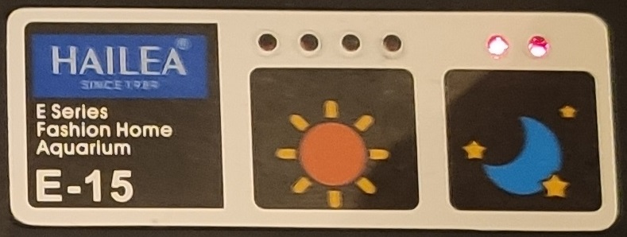
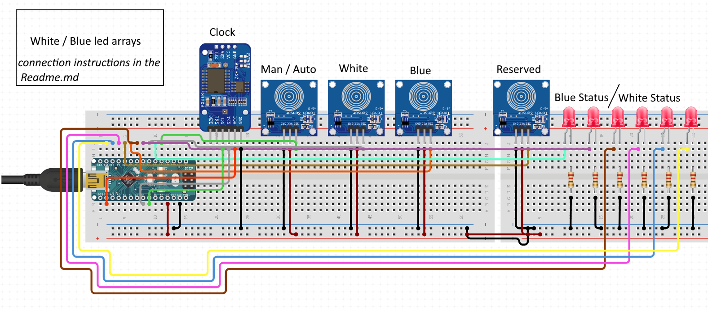

# Automated lights for an aquarium 
This project implements a contiuous system to illuminate any aquarium with a LED based lighting system. It has been implemented on a Hailea E-15 aquarium but it can be easily customized to fit others.

The idea is to have a continuous system that simulates the sun increasing / decreasing the light received by the plants and the fishes as the day goes. The system controls at the same time two kind of colors (white and a blue) to simulate the Sun and the Moon.

	

[Hailea](http://hailea.com/e-hailea/index.htm) is a Chinese company that builds average aquariums. In this case it is a small one (15 liters) that comes already with a manual led system so it makes it easier to modify it but anyone,  with or without included leds, can be modified to include this system.

	

# User Manual

The aquarium has two working modes that can be selected with the Mode touch key:

* Automatic: in this mode the aquarium mimics the world light with progressive changes on the lighting of white leds (sun) and blue leds (moon) following this chart:

* Manual:

(...)

In Manual mode you can change the lighting power of the white or the blue lights with the corresponding touch keys. The status leds show the the intensity on the leds (...)

# Materials

I am including links to the place were I bought them but I'm no way affiliated with them. It is a way to ensure that you have the same device I used.

* [Arduino Nano](https://www.aliexpress.com/item/32845416583.html?spm=a2g0s.9042311.0.0.48ec4c4dxoacGG) (I've used a 168 as it is the smalles one but anything goes)
* [RTC DS3231](https://www.aliexpress.com/item/32889773722.html?spm=a2g0s.9042311.0.0.27424c4dvry968) (Remember to get a battery, it is not included and needed)
* [TTP223 Capacitive touch key](https://www.aliexpress.com/item/32815466969.html?spm=a2g0s.9042311.0.0.27424c4dvkudii)
* [Red leds](https://www.aliexpress.com/item/32862878599.html?spm=2114.12010612.8148356.1.116019a6mAhl0N)
* [1K Resistor](https://www.aliexpress.com/item/33029770547.html?spm=a2g0s.9042311.0.0.27424c4dvkudii)

# Electrical Diagram

